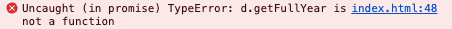

# "내일배움캠프를 시작하며" 페이지 제작

<br>
<br>

## 오늘의 실수

오늘의 다짐을 등록할 때 자동으로 오늘 날짜가 입력되도록 하는 과정에서
다음과 같은 에러가 발생함

```js
const d = Date();
let year = d.getFullYear();
let month = d.getMonth() + 1;
let day = d.getDate();
let date = `${year}/${month}/${day}`;
```



무엇이 문제일까 한참을 구글링하다가 아주 어처구니 없는 실수를 발견..

```js
const d = new Date();
```

위와 같이 고치니 에러가 바로 사라짐

조심하자!

<br>
<br>

## 빈 문자열 예외 처리

사용자가 오늘의 다짐을 등록할 때 입력해야 하는 두 항목 중 하나라도 입력하지 않으면 경고창을 보여주고, 다짐이 등록되지 않도록 처리하는 코드를 아래와 같이 작성함

```js
if (image.length === 0) {
  alert("오늘의 내 기분을 표현하는 이미지를 입력해 주세요.");
  window.location.reload();
} else if (comment.length === 0) {
  alert("오늘의 다짐 한 마디를 입력해 주세요.");
  window.location.reload();
}
```

하지만 같은 구문이 반복되는 것에서 불편함을 느끼고 아래와 같이 수정했는데 이건 또 불친절한 느낌

```js
if (image.length === 0 || comment.length === 0) {
  alert("모든 항목을 입력해 주세요.");
  window.location.reload();
}
```

좋은 코드 적기 어렵다🥲
