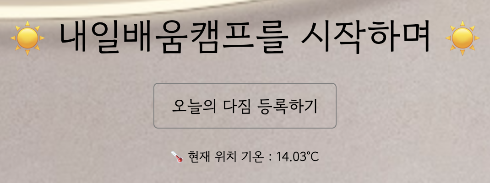

# "내일배움캠프를 시작하며" 페이지 제작

<br>
<br>

## OpenAPI를 활용해 현재 위치 기온 가져오기

geolocation API를 이용해 사용자의 위치에 대한 위도와 경도 값을 얻어 해당 지역에 대한 기온을 OpenWeatherMap API에서 받아와 그것을 사용자에게 보여주는 코드를 작성함

```js
if (navigator.geolocation) {
  navigator.geolocation.getCurrentPosition(function (position) {
    let latitude = position.coords.latitude;
    let longitude = position.coords.longitude;

    let apiKey = "***";
    let apiUrl = `https://api.openweathermap.org/data/2.5/weather?lat=${latitude}&lon=${longitude}&units=metric&appid=${apiKey}`;

    fetch(apiUrl)
      .then((response) => response.json())
      .then((data) => {
        let temp = data.main.temp;
        $("#temp").text(`🌡 현재 위치 기온 : ${temp}°C`);
      });
  });
}
```

그런데 아래와 같이 기온 정보가 나타날 때까지 무려 4초나 걸림..!



뭐가 문제인지 궁금해서 구글링해봤는데 OpenAPI 호출이 너무 느리다고 하는 사람들이 많다. 그런데 웹개발 종합반 강의 실습으로 미세 먼지 API를 호출했을 때에는 이렇게까지 느리지 않았는데.. 무슨 차이일까?
