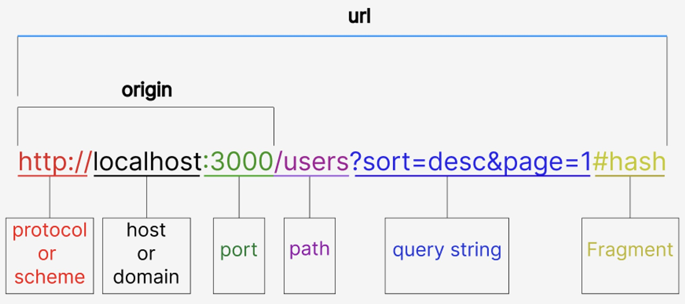

# 🧑‍🏫 React 입문 강의 수강

## destructuring

```js
// 객체의 구조문 할당
const person = {
  name: "르탄이",
  age: 25,
  job: "개발자",
};

const { name, age } = person;
console.log(`안녕하세요 ${name}님, ${age}살입니다.`);

// 중첩 객체의 구조문 할당
const movie = {
  title = "Inception",
  director: "Christopher Nolan",
  release: {
    year: 2010,
    month: "July"
  }
};

const {
  title,
  release: { year },
} = movie;
console.log(`영화의 제목은 ${title} (${year})입니다.`);

// 배열의 구조문 할당
const numbers = [1, 2, 3, 4, 5];

const [first, , third] = numbers;
console.log(first);
console.log(third);

function confirmReservation(user) {
  const { name, roomType, date: firstDate } = user;

  return `${name} 고객님의 ${roomType}룸 입실 날짜는 ${firstDate} 입니다.`
}

const userInfo = {
  name: "James",
  roomType: "Deluxe",
  date: "2023-05-30"
}
const result = "confirmReservation(userInfo)";
console.log(result);
```

## spread operator

```js
const originalUser = {
  name: "르탄이",
  age: 28,
}

// 참조하는 위치 복사
// 불변성이 깨짐
// const updatedUser = originalUser;

const updatedUser = ...originalUser;
updatedUser.name = "르링이";

const first = [1, 2, 3];
const second = [4, 5, 6];

const combinedArray = [...first, ...second];
```

## rest operator

```js
// 함수의 매개변수로 쓰임
function sum(...numbers) {
  return numbers.reduce((acc, cur) => acc + cur);
}

const result = sum(1, 2, 3, 4, 5);

// 객체 분해 할당 시, 여러 값을 그룹핑할 때 사용
const person = {
  name: "John",
  age: 30,
  country: "USA",
  occupation: "Developer",
};

const { occupation, ...rest } = person;
console.log(rest); // { name: "John", age" 30, country: "USA" }
```

## 화살표 함수

```js
// const add = function (a, b) {
//   return a + b;
// };

// return이 한 줄인 경우
const add = (a, b) => a + b;
```

## 조건연산자

```js
const score = 85;
const grade = score >= 80 ? "A" : "B";
```

## 단축평가

```js
// (1) 논리합 연산자
// falsy : false, 0, "", null, undefined, NaN
const getUserName = (user)
 => user.name || "신원미상";

// (2) 논리곱 연산자
const loggedIn = true;
const userName = "르탄이";

loggedIn && console.log(`환영합니다 ${userName}님!`);

// optional chaining
const user = {
  profile2: {
    name: "르탄이",
    details: {
      age: 30,
      location: "서울시 강남구",
    },
  },
  printHello: () => console.log("Hello"),
};

console.log(user.profile?.details.age); // undefined
user.printHello1?.();

// null 병합 연산자
let userLocation = null;
console.log(userLocation ?? "없는 위치");

const displayPreferences = (preference) => {
  const textLength = preference.textLength || 50;
  consol.log(textLength); // 50

  const itemsPerPage = preference.itemsPerPage ?? 10;
  console.log(itemsPerPage); // 0
}

const userPreference = {
  textLength: 0,
  itemsPerPage: 0,
};

displayPreferences(userPreference);
```

## Modules

재사용 가능한 코드 조각을 캡슐화하고 다른 자바스크립트 파일에서 쉽게 재사용할 수 있게 해줌

- 자바스크립트의 실행 환경은 브라우저 환경과 Node 환경이 존재
- Node 환경에서의 모듈 import 방식은 CommonJS 방식과 ES6 방식이 있는데 React 개발 환경은 대부분 ES6에서 제시한 방법을 사용

```js
// math.js
export const add = (a, b) => a + b;
export const ONE = 1;
export const sample = {
  one: 1,
  two: 2,
};

// app.js
import { add, ONE, sample } from "./math.js";
```

### 모듈을 사용해야 하는 이유 ⭐️

- 명확한 종속성 관리 : 각 모듈이 필요로 하는 종속성을 내부적으로 선언하므로 개발자는 파일을 로드하는 순서에 신경을 쓸 필요 없음
- 코드 캡슐화와 충돌 방지 : 전역 변수의 오염을 방지할 수 있고 이름이 서로 충돌하는 것을 막아줌
- 효율적인 코드 로딩 : 필요한 기능만을 선택적으로 불러올 수 있으며 이는 애플리케이션의 초기 로딩 시간을 단축시킴

### 고급 모듈 기능

```js
// 이름 바꾸기
import { square as sqr } from "./utils.js";

// 기본 내보내기
// math.js
export default function multiply(x, y) {
  return x * y;
}

// main.js
import m from "./math.js"; // 중괄호 X

// 전체 모듈 내용 가져오기
// app.js
import * as MathFunctions from "./math.js";

console.log(MathFunctions.add(10, 5));
```

## Async / Await

### Promise

비동기 작업의 최종 완료 또는 실패를 나타내는 객체

- Pending : 초기 상태, 아직 성공 또는 실패가 결정되지 않은 상태
- Fulfilled : 연산이 성공적으로 완료되어 프로미스가 결과 값을 반환한 상태
- Rejected : 연산이 실패하거나 오류가 발생한 상태

비동기 작업의 결과에 따라 콜백 함수를 연결할 수 있으며 .then(), .catch(), .finally() 메소드를 이용해 연속적으로 결과를 처리할 수 있음. 이를 통해 콜백 지옥을 피할 수 있음!

```js
const myPromise = new Promise(function (resolve, reject) {
  if (true) {
    resolve("Success!");
  } else {
    reject("Error!");
  }
});

myPromise
  .then(function (value) {
    console.log(value); // "Success!"
  })
  .catch(function (error) {
    console.error(error); // "Error!"
  });
```

### Async

함수 선언 앞에 async 키워드를 붙여 정의. 항상 Promise를 반환함

```js
async function fetchData() {
  return "Data loaded";
}

fetchData(.then(console.log)); // "Data loaded"
```

### Await

Promise의 완료를 기다리는 동안 함수의 실행을 일시적으로 중단하고 Promise가 해결되면 자동으로 함수의 실행을 재개. 비동기 코드의 동기적 표현이 가능

```js
async function fetchData() {
  try {
    const data = await fetch("");
    const json = await data.json();
  } catch (error) {
    console.log("Data loading failed".error);
  }
}

fetchData();
```

---

## React란

### 프레임워크와 라이브러리

- 프레임워크 : 개발자가 기능 구현에만 딱 집중할 수 있도록 모든 프로그래밍적 재원을 지원하는 기술의 조합
- 라이브러리 : 공통 기능의 모듈화가 이루어진 프로그램의 집합. React는 라이브러리에 해당

### 특징

- SPA(Single Page Application)
- 인기가 많음. 점유율이 어마어마함
- 웹 뿐만 아니라 모바일 애플리케이션 및 VR에서도 활용이 가능
- 커뮤니티가 막강함

## SPA

하나의 html 페이지로 이루어진 애플리케이션. 전통적인 MPA가 가지는 불편함(깜빡거림, 렌더링 속도 등) 때문에 등장하게 됨.

## Routing

### hash



- origin : 웹서버가 있는 위치
- localhost : 로컬 컴퓨터
- path, query string : 어떤 요청에 대한 상세한 요구사항

hash 뒤의 값은 요청 url 결정하지 않음. 서버에는 요청이 가지 않고 브라우저 안에서만 사용함

## npm과 yarn

둘 다 자바스크립트 런타임 환경에서 노드의 패키지 관리자.

### npm

npm(Node Package Manager)은 node.js를 설치할 때 자동으로 설치됨. 자바스크립트 프로그래밍 언어를 위한 패키지 관리자로 수많은 자바스크립트 라이브러리와 애플리케이션을 호스팅하는 레지스트리 역할을 함. 마치 애플스토어, 플레이스토어와 같은 것

### yarn

npm 기반이라 npm과 호환성이 좋다.

## Javascript 런타임 환경

프로그래밍 언어가 구동되는 환경 - 브라우저, node 환경

---

# 🧑‍🏫 JS 자가 진단

```js
// 자바스크립트 복습
let words = ["apple", "banana", "skip", "cherry", "stop", "date", "elephant"];

const resultArr = [];
for (let i = 0; i < words.length; i++) {
  if (words[i] === "stop") break;
  if (words[i] === "skip") continue;
  resultArr.push(words[i]);
}

console.log("resultArr:", resultArr.join(", "));

// 단축 속성명
let a = "hello";
let b = "world";

// const obj = {
//   a: a,
//   b: b,
// };
const obj = { a, b };

// 새로운 프로미스 생성할 때는 동기적으로 동작
// 프로미스의 결과에 접근할 때는 비동기적으로 동작
// 비동기적 코드는 동기적 코드가 모두 동작하고 난 이후 동작

function fetchDataWithError() {
  return new Promise((resolve, reject) => {
    setTimeout(() => {
      reject("Network Error");
    }, 1000);
  });
}

fetchDataWithError()
  .then(function (data) {
    console.log("Data:", data);
  })
  .catch(function (err) {
    console.log("Error:", err);
  })
  .finally(function () {
    console.log("Process Completed");
  });

// await 뒤 무조건 promise
// async function getData() {
//   let response = await fetch("");
//   let data = await response.json();
//   return data;
// }

function getData() {
  return fetch("").then((response) => response.json());
}

getData().then((data) => console.log(data));
```
